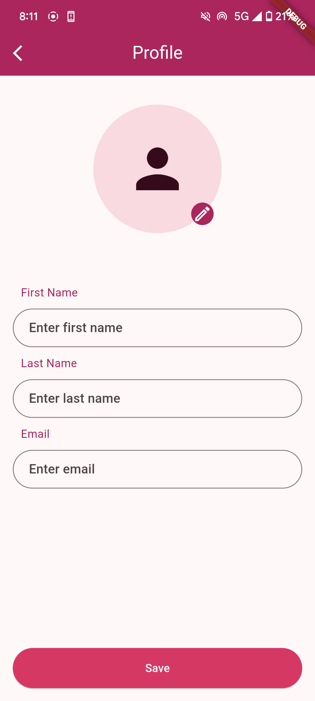
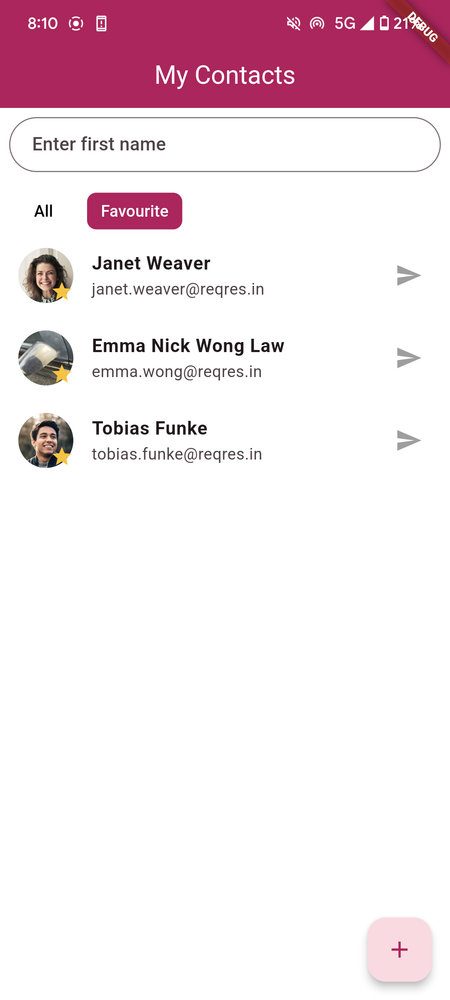
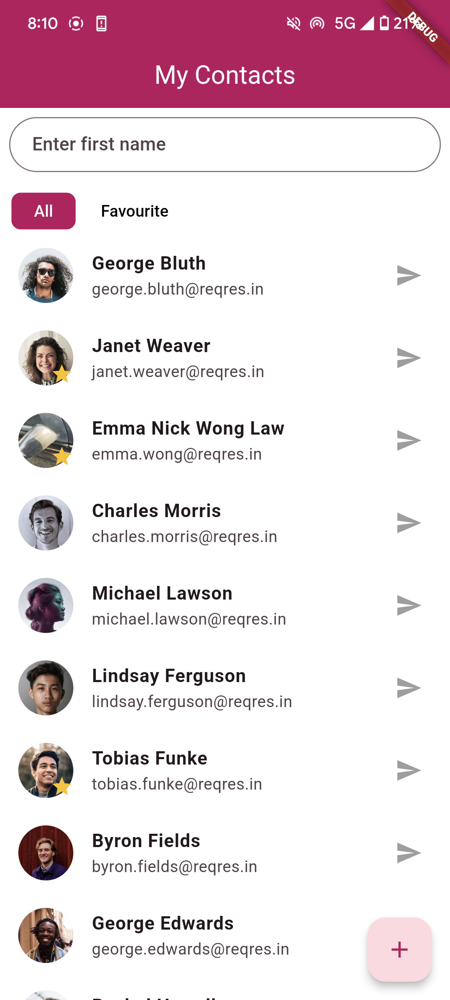
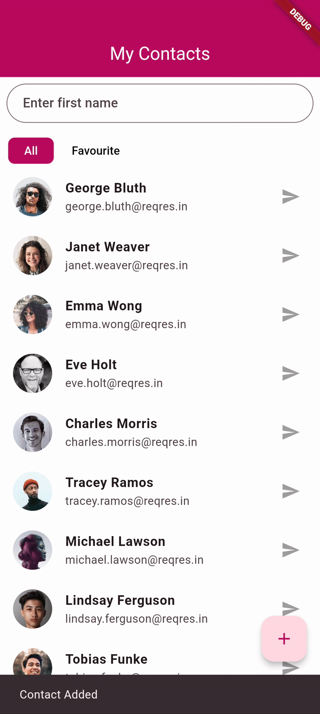

# 📇 Contact App Qbeep

A simple Flutter application to manage contacts.

## ✨ Tech Stack

- **Flutter** 3.24.5
- **Dart** 3.5.4
- **Android SDK** 35
- **Gradle Plugin**:
  - com.android.application
  - kotlin-android
  - dev.flutter.flutter-gradle-plugin

## 🚀 How to Run This App (Step by Step)

### ✅ Step 1: Clone the repository

```bash
git clone https://github.com/aimandesu/contact-app-qbeep
cd contact_app_qbeep
dart run build_runner build --delete-conflicting-outputs
flutter pub get
```

### ✅ Step 2: Run the application

Use your preferred method to run the Flutter app, such as:

```bash
flutter run
```

## App Preview

### Screenshots

<div style="display: flex; justify-content: space-between; align-items: center;">
  
  
  
</div>

### App Demo

<div style="display: flex; justify-content: center;">
  
</div>
